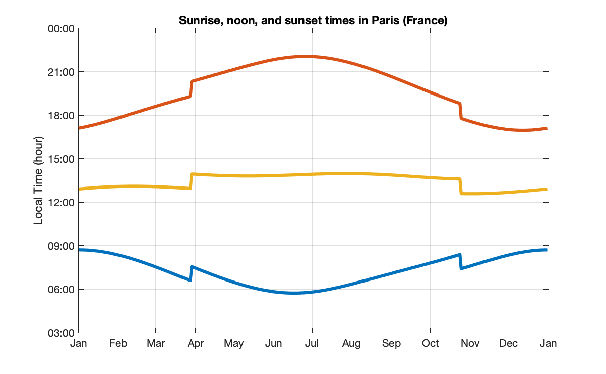

# Sunrise and sunset times

## sunrise.m
This function computes sunrise and sunset times from any location on Earth (latitude, longitude and altitude), for a given date and timezone, and also computes the reverse: latitude/longitude from sunrise/sunset times. The function is fully vectorized so any input parameters can be scalars, vectors or matrix (of the same size).

Without any argument, sunrise will try to guess your location (needs internet connection).



It is also possible to use two reverse functions:
- from the day length, it computes the corresponding latitude;
- from sunrise and sunset date/time it computes the corresponding latitude and longitude.
Both reverse function need altitude as input argument.

Examples:

To get sunrise/sunset of your current location:
```
>> sunrise
Location: 48.8582 °N, 2.3387 °E, 0 m
Sunrise: 10-Oct-2017 08:03:41 +02
Sunset: 10-Oct-2017 19:13:49 +02
Day length: 11h 10mn 8s
```

To compute the latitude corresponding to 14h of daylight at altitude 0m on April 21, 2019:
```
>> sunrise(14/24,0,'2019-04-21','day2lat')
Estimated latitude: 49.076°N
```

To compute the latitude and longitude corresponding to specific sunrise and sunset times:
```
>> sunrise('22-Apr-2019 04:52:12','22-Apr-2019 18:51:04',0,'sun2ll')
Estimated location: 47.9995°N, 2.00142°E
```
Type help sunrise or doc sunrise to get syntax and full documentation. See the function code for further explanations.
